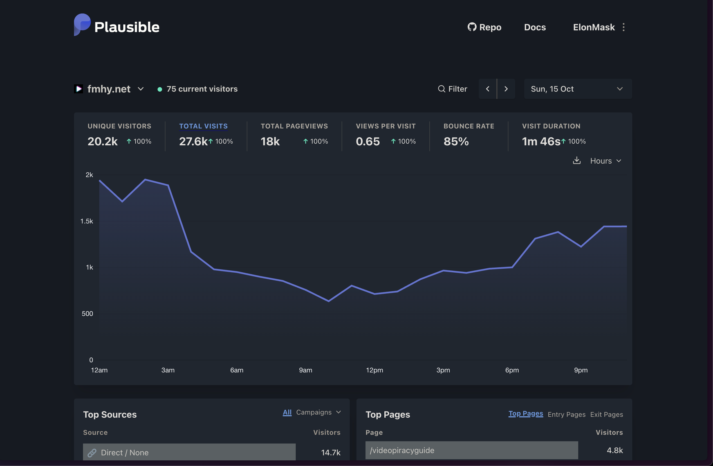

# Website for [FMHY](https://www.reddit.com/r/FREEMEDIAHECKYEAH/)

## Built using

- **Nextjs** For the frontend and serverless api routes
- **Typescript** For type safety
- **Tailwind CSS** For styling
- **Mantine UI** For components
- **Planetscale** As the database
- **Cheerio** For parsing the HTML (Old scraper)
- **Plausible** For analytics (stopped)

## Features:

- **Website**:
  - Detailed Wiki Page
  - Search
  - Guides page
  - Base64 page
- **Scraper**
  - Base 64, Wiki scrapers

## Usage stats

Migrated frontend from [React version](https://github.com/zeus-12/fmhy-ui), and backend from [Express Version](https://github.com/zeus-12/fmhy-server), and the scraper from [Fmhy Scraper](https://github.com/zeus-12/fmhy-scraper)

## What needs to be fixed | Open issues

### Common

- reset scroll to zero upon changing wiki category: seems to be an open nextjs issue => try using the workarounds.
- add sitemap, all that good seo stuff
- add piracy glossary somewhere.

### Design

- TYPOGRAPHY => spend some time on fixing the typography => look into shadcn-typography. better replace mantine w. shadcn. (toc drawer also needs a new design)
- toc drawer looks ugly.

### Markdown related

- see if dom issues can be fixed eg: (Warning: Received `true` for a non-boolean attribute `inline`.), probably can be fixed w. some remark package.
- for links hardcode reddit mappings to the corresponding page on the website.
- move all the notestarters,warningstarters,etc form all differetn renderers logic to single place: (`LiRenderer` is working fine => abstract the logic from there, and reuse)

### Search

- add a "copy item as markdown" button right next to each entry in search.
- use react-virtualised, and remove limits for the search
- highlight the word searched => use any of the syntaxhighlighting extensions for react-markdown for this
- check the `minisearch` see if its good enough to replace flexsearch => esp the fuzzysearch
